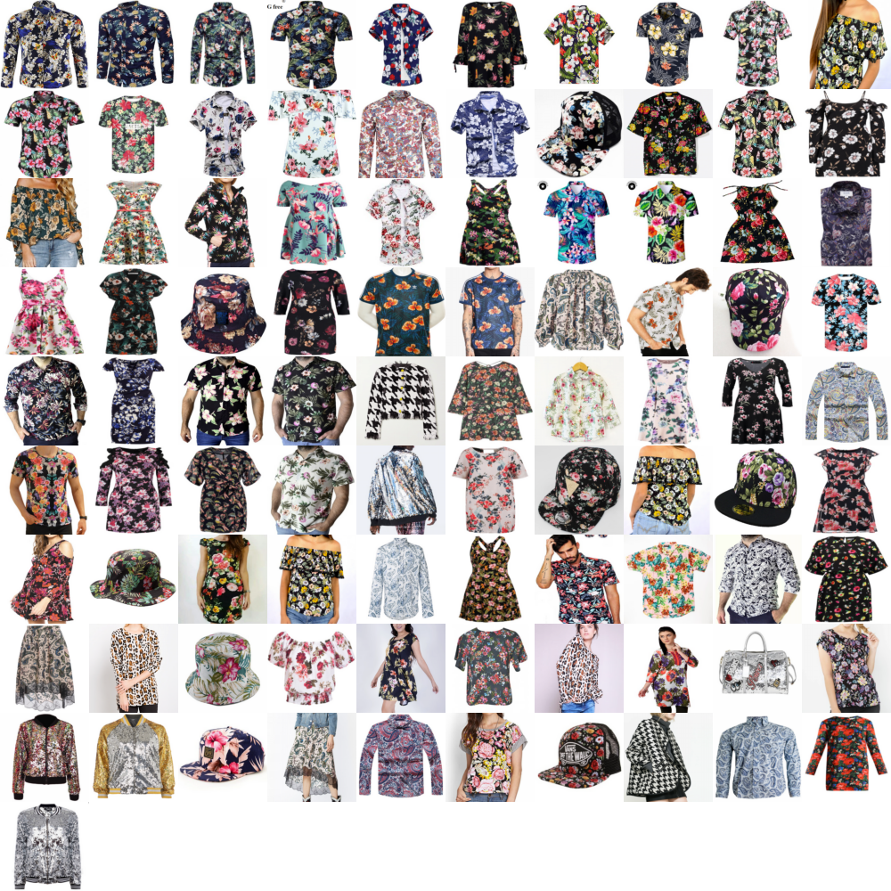

# Similarity Search
This project allows you to compute features and apply similarity search using a hidden layer of a ResNet50.

## Dependencies
This project depends on the project convnet2, that you can download from [here](https://github.com/jmsaavedrar/convnet2). So, you will need to set the local path of convnet2 at the top of the file [ssearch.py](ssearch.py).

## Compute Features of a Catalog
A catalog is a set of images used for querying. A catalog is defined by a text file listing all the filenames that you will process. For this example, you can use our catalog containing two sets of images, one containing images distributed in 10 different classes, and the other with 10 different textures.  The catalog was collected by Andres Baloian, and can be download from [here](https://www.dropbox.com/s/ri743kwqh8t6a7r/dataset_atributos.zip?dl=0).

In addition, to make the configuration easier, a configuration file is required. This configuration file has many parameters, but you only need to pay attention to the following params:

* DATA_DIR: The directory where the data is stored. A folder named *ssearch* should exist, because it will contain all the data produced by the script.
* IMAGE_WIDTH:  Width of the input image.
* IMAGE_HEIGHT: Height of the input image.
* CHANNELS: Number of channels of the input.

You can find an example of this configuraction file in [resnet50.config](config/resnet50.config).

Finally, the command to compute the catalog is:
```
python ssearch.py -config config/resnet50.config -name RESNET -mode compute
```
where RESNET is the name of a section in the configuration file.

## Querying
For queryng you can use the following command:
```
python ssearch.py -config config/resnet50.config -name RESNET -mode search
```

As you can note, we only have changed the paramenter *mode* to *search*. After running the previous command, the sysmem will ask you for a filename, that is the input query.
```
Query: test_images/flower_1.jpg
```
For instance, you can use the test images that come with this project.  Then, the search engine will look for similar images and a collage with the results is genereted in the current folder. In this case the result is stored in the file flower_1.jpg_l2_result.png, where the first image is the query.




